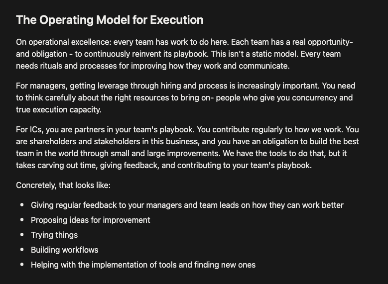

# [Suggestions] Meetings Proposal

### Reviewing Meetings

- Review each and every recurring team meetings
- Decide on what is worth keeping, what is worth dropping, and what is worth making changes.

### Pod Team Meetings

- Weekly Planning (Mondays 45-60 mins)
- Reduce daily to twice a week (Tuesday and Thursday, or Wednesday and Friday 15-30 mins)
  - Reminder not to jump into implementation and technical details about any task. Just high level overview and figure out how to unblock anyone that needs so.

### Engineering Team Meetings

- Weekly Meeting (Wednesdays 45 mins)
  - Introduction by VP or CTO (10 mins)
  - Very high level status of Pods (15 mins)
    - What is being done right now
    - What is next
    - Was anything left on-hold, postponed, cancelled
    - Anyone can jump in to request some cross-pod collaboration?
  - Space for anyone sharing interesting tech stuff (10 mins)
  - Space for anyone making proposals for improvements to process or product (10 mins)

### "No-meetings" Tuesday/Friday

- Having a day where the company has the policy of no recurring meetings, and people should avoid scheduling meetings for that that (unless no other option)

### 1:1 Meetings

- Weekly Meeting each person with their manager (30 mins)
- Any other?

