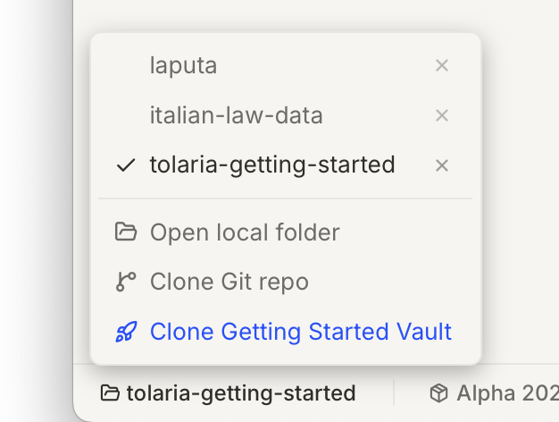
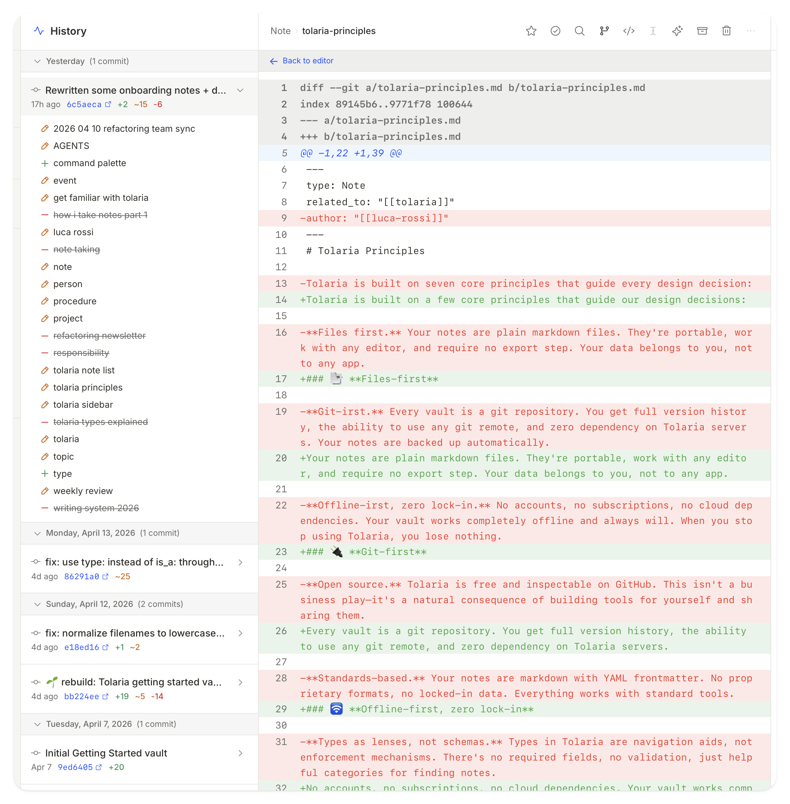
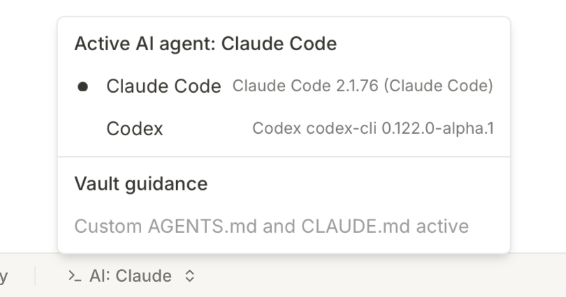

# Bottom Bar

The bottom bar is Tolaria's status bar — more informational than interactive. It keeps you aware of your current state without getting in your way.

### 📂 Vault selection

By clicking on the vault bottom left you can change the active vault, open a new local folder, or create a new one by cloning a Git repo

### 🔄 Git Sync Status

Shows pending uncommitted changes in your vault. When you see a count, you have uncommitted edits. Click to see what's changed or commit directly by clicking on `commit`.

If you have [[autogit]] enabled, the commit button automatically creates a commit message and push all changes to the main remote of the repo.

### ⚡ History

A lightweight git history view shows recent changes across all notes. See when notes were modified, by whom, and get quick access to change details.

### 🧮 App Version

The current Tolaria version. Useful when debugging or checking for new features.

### 🪄 AI Status

Shows which AI Agents are available — currently Claude Code and Codex are supported — and which one is selected. You can change AI agent from there as well.

### 📣 Feedback

You can get to Github issues to open bug reports or feature requests
